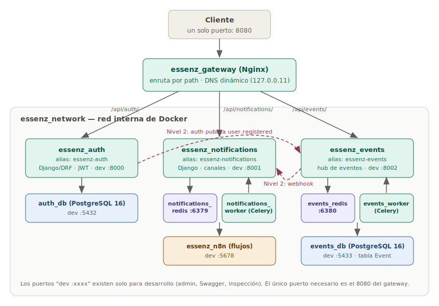

# 01 · Arquitectura

## Qué es el Master Orchestrator

Hasta ahora, cada microservicio Essenz vivía en su propia isla: su `docker-compose.yml`, sus puertos, su red de Docker privada. Funcionaba — pero un cliente tenía que conocer tres URLs distintas, y para que un servicio hablara con otro había que recurrir a `host.docker.internal`, un truco que solo funciona en desarrollo local.

El Master Orchestrator cierra el Nivel 1 uniendo las piezas **sin tocar el código de ningún microservicio**:

- Un **API Gateway** (Nginx) que expone un único puerto al exterior y enruta por path.
- Una **red interna** (`essenz_network`) donde los servicios se encuentran por nombre DNS.
- Un **docker-compose maestro** que construye las imágenes desde las carpetas de cada proyecto y levanta el ecosistema completo, en orden, con un comando.

La regla de oro: el orquestador es **pura infraestructura**. Si mañana essenz-auth cambia su lógica interna, el orquestador ni se entera; solo le importa que siga sirviendo HTTP en su puerto 8000.

## Diagrama de arquitectura



## Los 11 contenedores

| Contenedor | Imagen | Rol | Puerto host (solo dev) |
|---|---|---|---|
| `essenz_gateway` | nginx:1.27-alpine | Proxy inverso: único punto de entrada | **8080** |
| `essenz_auth` | build `./essenz-auth` | API de autenticación (Django/DRF) | 8000 |
| `auth_db` | postgres:16-alpine | Base de datos de auth | 5432 |
| `essenz_notifications` | build `./essenz-notifications` | API de notificaciones (Django) | 8001 |
| `notifications_worker` | misma imagen que su web | Worker Celery: despacha los canales | — |
| `notifications_redis` | redis:7-alpine | Broker de Celery de notifications | 6379 |
| `essenz_n8n` | build `./essenz-notifications/n8n` | Orquestador de flujos | 5678 |
| `essenz_events` | build `./essenz-events` | API del hub de eventos (Django) | 8002 |
| `events_worker` | misma imagen que su web | Worker Celery: procesa los eventos | — |
| `events_db` | postgres:16-alpine | Registro canónico de eventos | 5433 |
| `events_redis` | redis:7-alpine | Broker de Celery de events | 6380 |

Tres detalles importantes de esta tabla:

- **Cada servicio conserva su propia base de datos y su propio Redis.** Compartir una sola instancia "para ahorrar contenedores" acoplaría los servicios por la puerta de atrás: una migración pesada de events no debe poder tumbar el login de auth.
- **Los puertos del host son cortesía de desarrollo.** El único puerto que un cliente real necesita es el 8080 del gateway; el resto existe para abrir el admin de Django, Swagger o inspeccionar una base de datos con DBeaver. En producción se eliminan todos menos el del gateway.
- **Los workers no exponen nada.** Hablan solo con su Redis y su base de datos a través de la red interna.

## Orden de arranque

Docker Compose arranca el ecosistema por capas, gobernado por `depends_on` + healthchecks:

```
1º  Infraestructura:  auth_db, events_db, notifications_redis, events_redis, n8n
        (los healthchecks de Postgres y Redis marcan cuándo están listos)
2º  APIs Django:      essenz_auth, essenz_notifications, essenz_events
        (cada una espera a que SU base/broker esté healthy; aplican migraciones al arrancar)
3º  Workers Celery:   notifications_worker, events_worker
        (esperan además a que su web haya migrado, para no consumir tareas contra un esquema viejo)
4º  Gateway:          essenz_gateway
        (arranca al final: sus destinos ya existen en la red)
```

## Decisiones de diseño

- **No se reescribe nada.** El compose maestro usa los `build context` de las tres carpetas y los `.env` de cada proyecto tal cual. Cada microservicio sigue funcionando standalone con su propio compose — el maestro es una vista alternativa, no un reemplazo.
- **Las variables cruzadas viven en el compose maestro, no en los `.env`.** En Compose, `environment:` tiene prioridad sobre `env_file:`; el maestro sobrescribe únicamente las URLs de interconexión (ver [03 · Red y variables](03-red-y-variables.md)). Así los `.env` no se contaminan con detalles que solo aplican al stack unificado.
- **Alias DNS con guion para servicio-a-servicio.** Django rechaza cabeceras `Host` con guion bajo (`essenz_events` viola el RFC 1034/1035 y responde 400 aunque el DNS resuelva). Cada web tiene un alias RFC-válido: `essenz-auth`, `essenz-notifications`, `essenz-events`. El hallazgo completo está en [02 · Gateway](02-gateway.md).
- **El gateway resuelve DNS por petición, no al arrancar.** Un `upstream` estático de Nginx congela las IPs del momento del arranque; si Compose recrea un contenedor, el gateway queda apuntando al contenedor equivocado. La configuración usa el resolver embebido de Docker con TTL corto.
- **Gateway delgado a propósito.** Nada de lógica de negocio, autenticación ni transformación de payloads en Nginx: solo enrutamiento, cabeceras de proxy y timeouts. La autenticación es trabajo de essenz-auth (y en Nivel 2, de la validación de JWT en cada servicio).

## Estructura del proyecto

```
EssenzCompany/
├── docker-compose.yml        # Compose MAESTRO: 11 servicios, 1 red, 5 volúmenes
├── gateway/
│   ├── Dockerfile            # nginx:1.27-alpine + conf horneada en la imagen
│   └── nginx.conf            # Enrutamiento por path (documentado línea a línea)
├── docs/                     # Esta documentación
├── essenz-auth/              # Repo propio — clonar junto al orquestador
├── essenz-notifications/     # Repo propio — clonar junto al orquestador
└── essenz-events/            # Repo propio — clonar junto al orquestador
```

Las carpetas de los tres microservicios **no forman parte de este repo** (cada una tiene el suyo); el orquestador asume que están clonadas al lado. Ver [04 · Operaciones](04-operaciones.md#primer-arranque).

## Qué viene después (Nivel 2)

- **Integración real auth → events**: auth ya recibe `ESSENZ_EVENTS_URL`; falta el código que publique `user.registered` al registrar un usuario.
- **Integración real events → notifications**: events ya recibe `ESSENZ_NOTIFICATIONS_WEBHOOK_URL` apuntando a `/api/notifications/send/`; el esqueleto está comentado en `handle_user_registered`.
- **Autenticación servicio-a-servicio**: JWT de essenz-auth o API keys en la ingesta de events y el envío de notifications.
- **Gateway en producción**: TLS, rate limiting por ruta y eliminación de los puertos de desarrollo.
