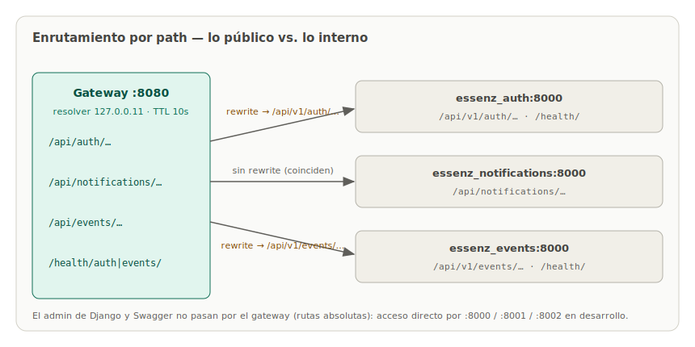

# 02 · API Gateway

## El trabajo del gateway

El gateway es la **única puerta de entrada** del ecosistema: un Nginx que escucha en el puerto 8080 del host y decide, según el path, a qué microservicio entregar cada petición.



| Ruta pública | Destino interno | Rewrite |
|---|---|---|
| `/api/auth/...` | `essenz_auth:8000/api/v1/auth/...` | sí |
| `/api/notifications/...` | `essenz_notifications:8000/api/notifications/...` | no (coinciden) |
| `/api/events/...` | `essenz_events:8000/api/v1/events/...` | sí |
| `/health/auth/` | `essenz_auth:8000/health/` | sí |
| `/health/events/` | `essenz_events:8000/health/` | sí |
| `/` | — | responde el mapa de rutas en JSON |

¿Por qué hay rewrite? Porque el contrato público del gateway (`/api/auth/`) es más corto que las rutas internas versionadas de cada Django (`/api/v1/auth/`). El cliente ve una URL limpia; el versionado interno queda como asunto de cada servicio.

El **admin de Django y Swagger no pasan por el gateway**: generan enlaces con rutas absolutas (`/admin/`, `/static/...`) que se romperían detrás de un prefijo reescrito. En desarrollo se acceden directo por los puertos 8000/8001/8002.

## La configuración, por bloques

### Resolución DNS dinámica

```nginx
resolver 127.0.0.11 valid=10s ipv6=off;

set $auth_backend          essenz_auth;
set $notifications_backend essenz_notifications;
set $events_backend        essenz_events;
```

`127.0.0.11` es el DNS embebido de Docker. La pieza clave es usar **variables** en `proxy_pass`: cuando el destino es una variable, Nginx lo resuelve **en cada petición** (respetando el TTL de 10s) en lugar de una sola vez al arrancar.

### Enrutamiento con rewrite

```nginx
location /api/auth/ {
    rewrite ^/api/auth/(.*)$ /api/v1/auth/$1 break;
    proxy_pass http://$auth_backend:8000;
}
```

El `rewrite ... break` transforma el path público en el interno y el `proxy_pass` con variable lo entrega al contenedor. Con variables, Nginx no hace la traducción automática de URIs que haría un `proxy_pass` con path literal — por eso el rewrite explícito.

### Cabeceras y timeouts

```nginx
proxy_set_header Host              $host;
proxy_set_header X-Real-IP         $remote_addr;
proxy_set_header X-Forwarded-For   $proxy_add_x_forwarded_for;
proxy_set_header X-Forwarded-Proto $scheme;

proxy_connect_timeout 5s;
proxy_read_timeout    30s;
```

Cada Django recibe el `Host` original del cliente y su IP real — necesario para CSRF, CORS y para construir URLs absolutas correctas. Los timeouts garantizan que un backend caído falle rápido (502 en 5 segundos) en vez de colgar al cliente.

## Los dos problemas reales que esta configuración resuelve

Estos dos fallos aparecieron durante la verificación end-to-end del stack; la configuración actual existe por ellos.

### 1. Django rechaza `Host` con guion bajo

El requisito original era que los servicios se hablaran como `http://essenz_events:8000`. El DNS de Docker resuelve ese nombre sin problema... y Django responde **400 Bad Request**:

```
Invalid HTTP_HOST header: 'essenz_events:8000'.
The domain name provided is not valid according to RFC 1034/1035.
```

El guion bajo no es válido en un hostname según el RFC, y Django lo verifica **antes** de consultar `ALLOWED_HOSTS` — ni `["*"]` lo salva. La solución: cada web tiene un **alias de red con guion** (`essenz-auth`, `essenz-notifications`, `essenz-events`), que sí es RFC-válido, y todas las URLs servicio-a-servicio usan el alias. El `container_name` con guion bajo se conserva para `docker logs`/`docker exec`.

El gateway no sufre este problema porque reenvía el `Host` del cliente original (`localhost:8080`), no el nombre del contenedor.

### 2. Un `upstream` estático congela las IPs

La primera versión usaba bloques `upstream` clásicos. Funcionó — hasta que `docker compose up -d` recreó los contenedores web y las IPs se barajaron: el gateway empezó a entregar `/api/events/` **al contenedor de auth** (que respondía 404 con su propio URLconf). Los healthchecks daban 200 engañosamente, porque ambos servicios tienen `/health/`.

La causa: Nginx resuelve los nombres de un `upstream` **una sola vez, al cargar la configuración**, y se queda con esas IPs para siempre. La solución es el bloque de resolución dinámica de arriba: resolver de Docker + variables + TTL corto. Con eso, recrear contenedores ya no rompe el enrutamiento.

> **Moraleja operativa:** si alguna vez ves al gateway entregando una ruta al servicio equivocado, sospecha de IPs congeladas. Con la configuración actual no debería ocurrir; `docker compose restart gateway` lo corrige en cualquier caso.

## La imagen

```dockerfile
FROM nginx:1.27-alpine
COPY nginx.conf /etc/nginx/conf.d/default.conf
EXPOSE 80
```

La configuración va **horneada en la imagen** (no montada como volumen): la imagen es autocontenida y portable, y un cambio de configuración pasa por un rebuild explícito (`docker compose up -d --build gateway`), que queda registrado. No se puede validar con `nginx -t` en build porque los nombres de los backends solo resuelven dentro de `essenz_network`.
